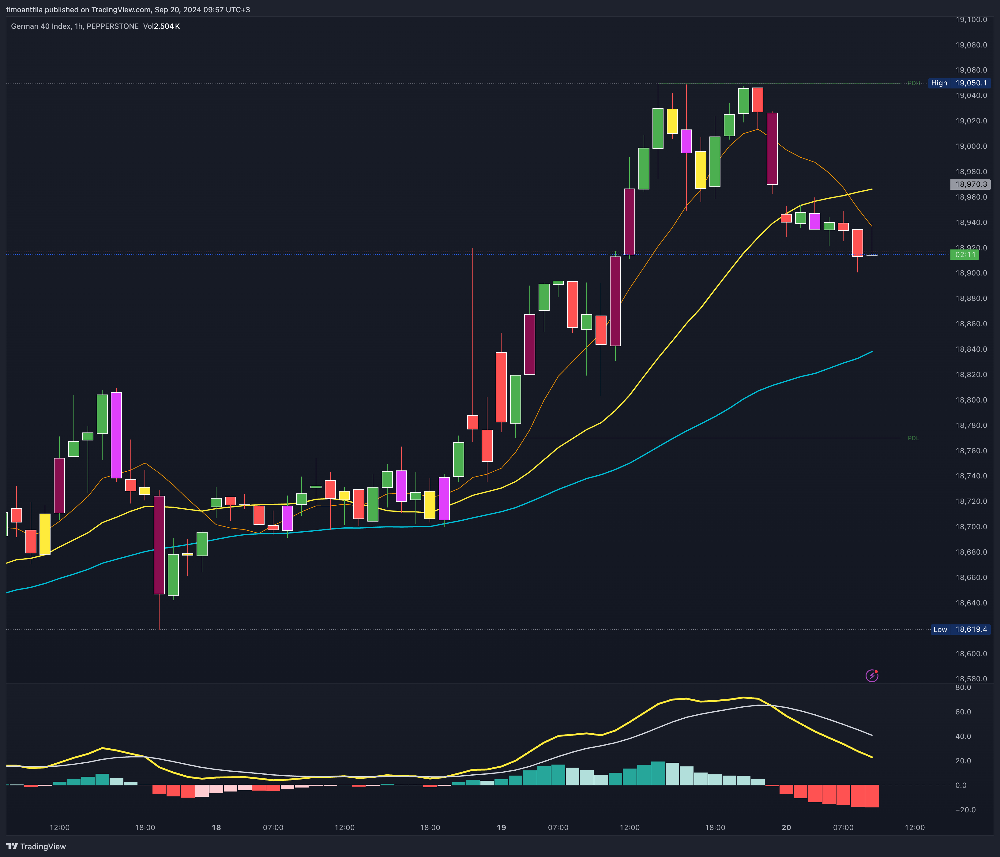

# Previous Daily High and Low

Using the previous day's high and low can provide key insights for trading decisions, offering important support and resistance levels. These levels help traders identify potential price reversals, breakouts, and areas to place stop-loss orders, thus improving trading strategies.

## Support and Resistance Levels

**Support**: The previous day's low can act as a support level. If the price approaches this level and holds, it may be a good point to enter a long position, anticipating a bounce.
  
**Resistance**: The previous day's high can act as a resistance level. If the price approaches this level and fails to break through, it might be a good point to enter a short position, anticipating a pullback.

## Breakout Trading

**Bullish Breakout**: A price break above the previous day's high with strong volume can indicate a bullish breakout. Traders may enter a long position, expecting the upward momentum to continue.
  
**Bearish Breakdown**: A price break below the previous day's low with strong volume can indicate a bearish breakdown. Traders may enter a short position, expecting the downward momentum to continue.

**False Breakouts**: Sometimes the price may break the previous day's high or low but then quickly reverse. These false breakouts can be used to enter trades in the opposite direction, anticipating that the initial move was a trap.

## Range Trading

When the price moves between the previous day's high and low, traders can use these levels to trade within the range. Buying near the low and selling near the high can be an effective strategy in a ranging market.

## Stop-Loss Placement

Setting stop-loss orders just below the previous day's low for long positions or just above the previous day's high for short positions can help manage risk. This ensures that if the price moves against the position, losses are minimized.

## Adding the Script to TradingView

1. Open TradingView and log in to your account.
2. Click on the `Pine Editor` tab at the bottom of the screen.
3. Delete any existing code in the editor and paste the Pine Script code from GitHub.
4. Click `Add to Chart` above the editor to apply the script to your chart.