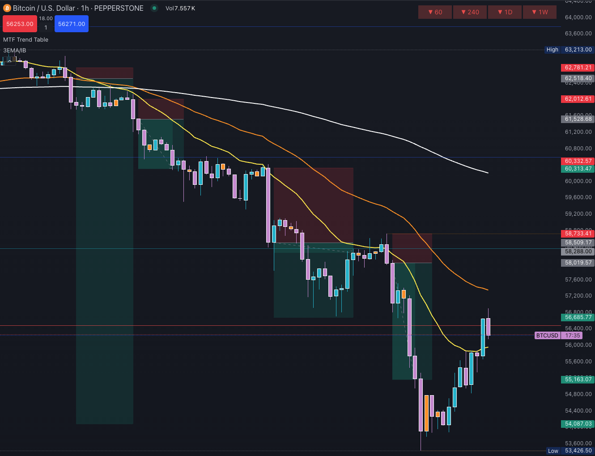
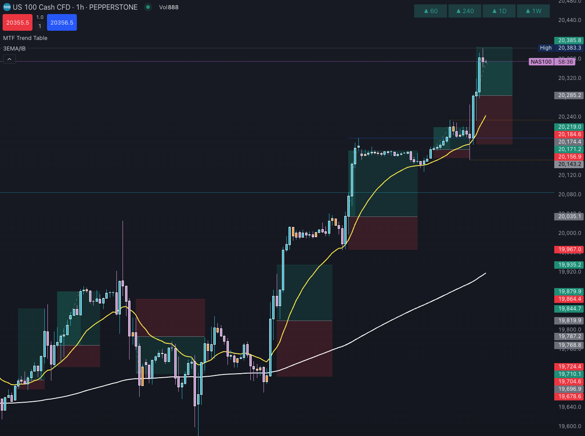

# Tuspe special mix v1.0

These scripts are designed for use on [TradingView](https://www.tradingview.com/), a popular platform for traders to perform technical analysis and execute trades. It combines essential tools like moving averages, candlestick identification, displacements, previous day alerts, and trade signals.

These scripts are created and maintained by [Timo Anttila](https://timoanttila.com/). It's free to use and modify, but I encourage collaboration - let's improve this script together instead of creating separate versions. If you have suggestions or ideas, feel free to reach out.

## Moving average (MA)

An Exponential Moving Average (EMA) gives more weight to recent prices, making it more responsive than a Simple Moving Average (SMA). Moving averages (MAs) help identify trends, reversals, and potential entry or exit points. These scripts plot moving averages to capture short-, medium-, and long-term market movements. MAs can also act as dynamic support or resistance levels and are commonly used in crossover strategies to signal trend changes.

## The Turtle Strategy

[The Turtle Strategy Indicator](./Turtle.pine)

**System 1:**  
Buy 20-day breakout.  
Exit 10-day low.

**System 2:**  
Buy 55-day breakout.  
Exit 20-day low.

N = 1 ATR

Add units at each half N profit for pyramiding.

**Exit rules:**  
Initial stop: 2N  
10- or 20-day reversal  
Never move stops away from position.

**Position sizing:**  
Unit Size equals 1% of Account divided by N times Dollar Value per Point.

N, Average True Range Calculation. Take the higher of: Today's high minus low, Today's high minus yesterday's close or yesterday's close minus today's low. Calculate 20-day average of above.

[Read more](https://www.youtube.com/watch?v=g8XHUYVOPkU)

## The 10 EMA Strategy

Highlights potential bullish and bearish entries after the first opposite candle following a crossover of `MA1`. A trade is confirmed (triangle) only if the price closes above (bullish) or below (bearish) the X-marked candle.

The strategy aims to identify the first opposite candle above or below the 10 EMA and enter a trade when its high (bullish) or low (bearish) is broken. The target is a minimum 1:1 risk-reward, preferably 1:2.

[The 10 EMA Strategy Indicator](./The10EMA.pine)

## The Pullback Strategy

This version is more reliable than the indicator above, but it occurs less frequently than the strategy above. This improved version uses deeper pullbacks before confirming the pullback (X).

[The Pullback Strategy Indicator](./Pullback.pine)

### Market direction

- Uses `MA1` (default: 50 SMA) to determine trend.
- **Bullish**: Price breaks above `MA1` and makes a new high.
- **Bearish**: Price breaks below `MA1` and makes a new low.

### Pullback criteria

After breaking `MA1`, wait for the price to close below `MA2`. This filters out weak signals caused by sideways movement or small candles, confirming an actual pullback.

### Bullish entry

- Price closes above `MA2`.
- Green candle body larger than previous red candle (engulfing).
- Entry at green candle close (triangle up).
- Stop-loss below green candle.

### Bearish entry

- Price closes below `MA2`.
- Red candle body larger than previous green candle (engulfing).
- Entry at red candle close (triangle down).
- Stop-loss above red candle.

### Trade execution

- Entry only on valid engulfing candles (marked with triangle).
- Stop-loss below/above the engulfing candle.
- Target at least 1:1, preferably 1:2 risk/reward.
- Best used on 1-hour charts.
- Works across Forex, Crypto, and Stocks.

## The golden crossover

Identifies trend changes based on moving average crossovers.

[Moving Averages Strategies](./MovingAveragesStrategies.pine) (only same direction than `MA1`)

### Trade setup

- **Bullish**: `MA2` crosses above `MA3`, and both are above `MA1`.
- **Bearish**: `MA2` crosses below `MA3`, and both are below `MA1`.
- If `MA2` crosses `MA1`, a white flag is shown.

This works best on 5 or 15-minute charts in trending markets. Avoid using during sideways conditions. I only trade in the direction of the daily trend.

Don’t enter trades immediately after the crossover. It’s safer to wait for a price pullback to `MA2` with a candle showing a long wick against the trend (signaling rejection).

Use a tight stop-loss and aim for a minimum 1:1 risk/reward. Let winners run until price closes on the other side of the Medium EMA or a new crossover occurs.

## Trades from 20 EMA / SMA

In the image above, the price is below the 200 EMA, and the 20 EMA acts as resistance. A trade entry at the first break through the 20 EMA could have yielded a 1:34 risk/reward. Several strong entries appeared in this downtrend.

Look for:

- Strong break through 20 EMA.
- Bounce from 20 EMA with an engulfing candle.
- Color change: two candles together are larger than the previous opposite-color candle.

## Previous daily high and low

Using the previous day's high and low helps identify strong support and resistance levels for better trading decisions, including reversals, breakouts, and stop-loss placements.

### Support and resistance

- **Support**: Previous day's low. Price holding this level may indicate a good long entry.
- **Resistance**: Previous day's high. Failure to break through may offer a shorting opportunity.

### Breakout trading

- **Bullish breakout**: Strong close above previous high suggests a long opportunity.
- **Bearish breakdown**: Strong close below previous low suggests a short opportunity.
- **False breakouts**: Quick reversals after a breakout can offer trades in the opposite direction.

### Range trading

When price is moving between the previous high and low, buy near the low and sell near the high. This is effective in non-trending markets.

### Stop-loss placement

- For long trades: just below previous day’s low.
- For short trades: just above previous day’s high.

This minimizes losses when the trade goes against you.